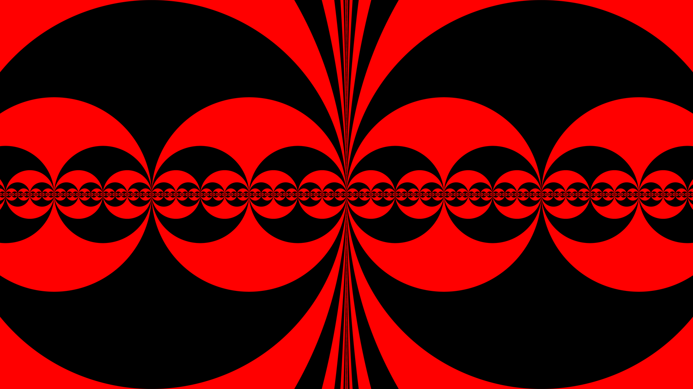

# Draw-XY

Lightweight image generator.  
For customization the source code has to be changed.

# Makefile

## Env List

| Name       | Default                             | What                                                     |
| :--------- | :---------------------------------- | :------------------------------------------------------- |
| IN_WIDTH   | 1600                                | Input width                                              |
| IN_HEIGHT  | 900                                 | Input height                                             |
| OUT_WIDTH  | IN_WIDTH                            | Output width                                             |
| OUT_HEIGHT | IN_HEIGHT                           | Output height                                            |
| CHANNELS   | 4                                   | Pixel channel number (1..4: gray, ~ alpha, rgb, ~ alpha) |
| RATE       | 24                                  | Frame-rate                                               |
| LENGTH     | image: 0, frames: RATE, video: RATE | Length                                                   |
| FRAME      | 0                                   | Start frame                                              |
| INDEX      | 0                                   | Start index                                              |
| REPEAT     | 0                                   | Repeat rendered video X times                            |
| IMAGE_FILE | image.png                           | Output image file                                        |
| FRAMES_DIR | frames                              | Output frames dir                                        |
| VIDEO_FILE | video.mp4                           | Output video file                                        |

## Usage

```sh
# Image target
make CHANNELS=1 image
make install && ./draw-xy.exe -c 1 | ffmpeg ...

# Frames target
make IN_WIDTH=680 IN_HEIGHT=420 frames
make install && ./draw-xy.exe -w 680 -h 420 | ffmpeg ...

# Frames target on my machine (test)
make CHANNELS=1 IN_WIDTH=320 IN_HEIGHT=280 RATE=60 frames && sxiv frames

# Video target
make REPEAT=2 video

# Video target on my machine (test)
make REPEAT_VIDEO=5 CHANNELS=3 IN_WIDTH=3840 IN_HEIGHT=2160 RATE=60 video && mpv --loop-file video.mp4 --video-unscaled
```

# For Source Code Editing

## Globals

```c
// config.h
#ifdef __CONFIG_EXTERN__
extern
#endif
    int config_width,
    config_height,
    config_channels,
    config_rate,
    config_frame,
    config_index,
    config_length,
    config_image_bytes,
    config_pixels_count,
    config_buffer_size;
```

## What to Change?

```c
// plot.c
#include "..."

void plot(unsigned char pixel[], double x, double y)
{
    // Your Code Here
    pixel[0] = pixel[3] = 255 * sin(x * y) / cos(y / x) / atan((double)config_index / config_rate);
}
```

# Output Examples

## XCP Red Image

```sh
# XCP Red
make CHANNELS=3 IN_WIDTH=16000 IN_HEIGHT=9000 OUT_WIDTH=1600 OUT_HEIGHT=900 image && sxiv image.png
```



## XCP Red 4k60 Video

```sh
# XCP Red 4k60 Video
make REPEAT_VIDEO=5 CHANNELS=3 IN_WIDTH=3840 IN_HEIGHT=2160 RATE=60 video && mpv --loop-file video.mp4 --video-unscaled
```

[XCP Red 4k60 Video Link](https://youtu.be/DElDPxMU60Q)

# License

[GPLv3](https://www.gnu.org/licenses/gpl-3.0.txt)

_See notice in [ACKNOWLEDGEMENTS.md](ACKNOWLEDGEMENTS.md)_
